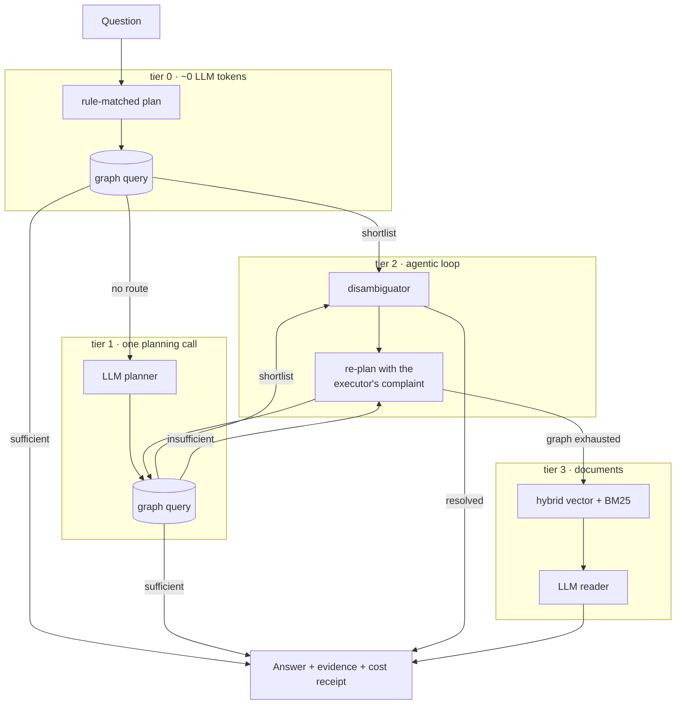

# OCCAM

**Cost-aware Agentic GraphRAG on TigerGraph — measuring when an agent is worth its tokens.**

> *Entities should not be multiplied beyond necessity — and neither should retrieval steps.*

Built for the [TigerGraph Agentic GraphRAG Hackathon](https://alluring-beryllium-491.notion.site/Agentic-GraphRAG-Hackathon-Guidebook-34fc2cb129c08146998af3568d7d2594).

The guidebook asks a sharper question than "is agentic better":

> *"The objective is not simply to measure whether Agentic GraphRAG produces a better answer.
> It is to determine whether the additional reasoning and retrieval steps are worth the
> additional complexity and token cost."*

OCCAM answers it with numbers. It runs all three required pipelines, and adds a fourth —
a controller that routes each question to the cheapest tier that can actually answer it.

## Headline result

100 public questions, four pipelines, zero errors:

| Pipeline | Accuracy | Evidence recall | Tokens / question | Tokens / correct answer |
|---|---:|---:|---:|---:|
| RAG | 63% | 76% | 3,259 | 5,174 |
| GraphRAG | 97% | 98% | 838 | 864 |
| Agentic GraphRAG | **100%** | 99% | 890 | 890 |
| **OCCAM (routed)** | **100%** | **99.5%** | **64** | **64** |

**The agent tier changed the answer on 3 of 100 questions and broke none, at 1,740 extra
tokens per question rescued. Routing reaches the same 100% for 64 tokens per question,
because 98 questions never need a language model at all.**

That is the finding: on this benchmark agentic reasoning is decisive on ~3% of questions
and pure overhead on the rest. The value is not in *having* an agent — it is in knowing
which questions need one.

Full dashboard: [`artifacts/dashboard.html`](artifacts/dashboard.html) ·
raw runs: [`artifacts/results_public.jsonl`](artifacts/results_public.jsonl),
[`artifacts/results_hidden.jsonl`](artifacts/results_hidden.jsonl)

## Where each approach breaks

| Question type | RAG | GraphRAG | Agentic | OCCAM |
|---|---:|---:|---:|---:|
| lookup | 100% | 100% | 100% | 100% |
| multi_hop | 75% | 96% | 100% | 100% |
| temporal | 68% | 91% | 100% | 100% |
| aggregation | **10%** | 100% | 100% | 100% |
| superlative | 60% | 100% | 100% | 100% |

RAG does not degrade gracefully on aggregation — it fails **structurally**. *"How many
cycling events at the 2008 Summer Olympics had more than 30 competitors?"* needs every
cycling event at those Games: a median of 11 documents and up to 43. No top-10 retrieval
holds that evidence, whatever the prompt says. A graph aggregation answers it exactly,
and the model never sees the rows.

Its 60% on superlatives is worse news than it looks. Evidence recall there is **0.16** —
it names a plausible winner (the marathon usually does have the most competitors) without
ever retrieving the documents that would settle it. Answer accuracy alone would have
scored that as success. The dashboard charts accuracy against evidence recall precisely
so that gap is visible.

## How it works



Every tier reports *what it was missing*, and that complaint is what triggers the next
step — escalation is never a guess about difficulty. Two consequences matter:

- **The controller cannot silently skip evidence.** A tier hands over only when it can
  name the gap, and the gap is recorded in the trace.
- **Ambiguity is not a planning failure.** When a traversal returns a shortlist, the graph
  already found the right neighbourhood; re-planning just reproduces the same shortlist at
  full price. OCCAM goes straight to applying the constraint the question states. This one
  change took the hardest question from 1,964 tokens to 267.

### Graph schema

```
Games(year, season) --HAS_EVENT--> Event --AT_VENUE--> Venue
                                   Event --IN_SPORT--> Sport
                                   Event --WON_GOLD|SILVER|BRONZE--> Athlete --REPRESENTS--> NOC
                                   Event --PREV_EDITION--> Event
Chunk(text, emb vector[384]) --SOURCED_FROM--> Event
```

Embeddings live on `Chunk` as a TigerVector attribute rather than in a separate service,
so a filtered similarity search can run *inside* a traversal with no cross-system join.

`PREV_EDITION` is materialised from each page's own `prev` field, which makes *"the
Olympics held immediately before 2016"* a single edge hop rather than a scan. Answering
temporal questions by traversing that edge — and citing the anchor event as well as the
target — took evidence recall on that question type from 50% to 95%.

## What the corpus actually is

Worth stating plainly, because it shaped every design decision: the organisers supply the
corpus and score against 50 held-out questions, so the domain is fixed. It is **2,951
Wikipedia documents — 2,210 Olympic event pages plus 740 distractors** (films, companies,
politicians) that no supplied question touches. They exist to punish naive similarity
search, and they do.

Every answerable fact lives in an `[Infobox Olympic event]` block. **Extraction fidelity,
not retrieval cleverness, sets the accuracy ceiling.** Two bugs found by reading the corpus
rather than trusting it:

- **25 tennis pages stack two infoboxes.** A sport-specific box comes first, and the
  `[Infobox Olympic event]` block carrying venue, date and medallists comes second.
  Reading only the first loses all of it — and one held-out question asks exactly that.
- **Splitting run-together team rosters** (`Dani KingLaura TrottJoanna Rowsell`) on a
  Latin-1 character range mangles names like `Süleymanoğlu`, because those ranges contain
  lowercase letters too. The split tests `str.isupper()` per character instead.

The parser is deliberately strict: a field it cannot read confidently stays `None`, and
aggregation reports the gap rather than undercounting silently. 78 of 2,210 pages have no
numeric `competitors` field, and a count over them says so.

## Honest limits

- **Tier 0 is a cache, not understanding.** Its rules match the five question shapes in
  this benchmark. The generalisation number is GraphRAG's **97%** — that pipeline plans
  every question with the LLM and no rules. If every question were novel, OCCAM degrades
  to tier 1 and costs one planning call, not zero.
- **A relational database could also do the aggregations.** The graph earns its place on
  the traversals (venue → event → medallist, `PREV_EDITION` chains) and on keeping vectors
  beside the rows, not on `COUNT(*)`.
- **Held-out accuracy is not self-reported.** `artifacts/results_hidden.jsonl` contains raw
  answers, tokens and full traces for all 50 questions; scoring is the organisers'.
- **Single LLM, single run.** All numbers are Gemini at temperature 0. No variance bars.

## Running it

```bash
uv venv && uv pip install -e ".[dev]"
cp .env.example .env          # add GEMINI_API_KEY
python scripts/download_data.py
python scripts/build_index.py          # one-off: 18,762 chunks, cached
python scripts/run_benchmark.py        # 100 questions x 4 pipelines
python scripts/build_dashboard.py
```

Walk a single question through all four pipelines with the full trace:

```bash
python scripts/demo.py pub-055
```

Load the graph into TigerGraph (Savanna or Community Edition):

```bash
python scripts/load_tigergraph.py --schema --vectors --load --queries
```

`--dry-run` prints the GSQL without needing a cluster.

## Layout

| Path | What it holds |
|---|---|
| `occam/ingest/parse.py` | infobox extraction, date normalisation, roster splitting |
| `occam/store/local.py` | in-memory graph — the reference implementation |
| `occam/store/tigergraph.py` | schema, loader, and the GSQL behind each agent tool |
| `occam/store/vectors.py` | chunking + hybrid dense/BM25 retrieval |
| `occam/agents/plan.py` | `QueryPlan`, the executor, and the rule cache |
| `occam/agents/planner.py` | LLM planner — question to plan over the schema |
| `occam/pipelines/` | `rag`, `graphrag`, `agentic`, `router` |
| `occam/eval/` | harness, metrics, report, dashboard |

All four pipelines execute the *same* `QueryPlan` against the *same* graph. What differs is
only who writes the plan — a rule, one LLM call, or an agent that reads the result and
rewrites it. That is what makes the comparison a benchmark rather than three unrelated
systems.

## Measuring "did it investigate?"

Answer accuracy cannot tell a system that found the evidence from one that guessed well.
The public questions ship `gold_doc_ids`, so every run is scored on retrieval directly:

- **evidence recall** — share of the question's gold documents the pipeline actually retrieved
- **evidence precision** — share of retrieved documents that were gold
- **cost to correct** — tokens spent per correct answer
- **strategy changes** — times the plan was rewritten after seeing evidence
- **stop reason** — recorded in plain language on every run

RAG's 63% accuracy against 76% evidence recall, with superlatives at 0.16, is the whole
argument for reporting both.
