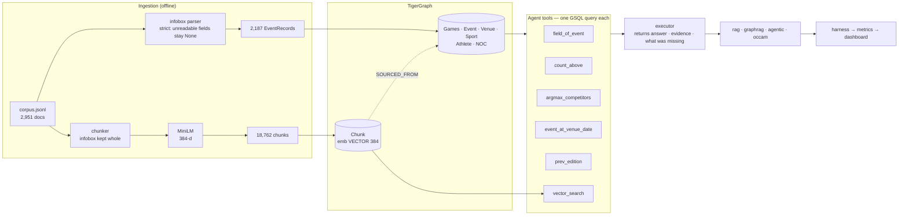

# OCCAM — architecture

## System



## The one contract

Every pipeline answers by executing a `QueryPlan` against the same graph:

```python
QueryPlan(intent, sport, games_year, games_season, gender, discipline,
          venue, date, title, field_name, threshold, answer_field)
```

What differs between pipelines is **only who writes the plan**:

| Pipeline | Plan author | On failure |
|---|---|---|
| RAG | *(no plan — top-k chunks → reader)* | answers anyway |
| GraphRAG | one LLM call | reports insufficiency, stops |
| Agentic | LLM, re-invoked with the executor's complaint | re-plans, disambiguates, falls back to documents |
| OCCAM | rule cache, then LLM, then agent | escalates one tier at a time |

Keeping execution identical is what makes this a benchmark rather than three
unrelated systems: a difference in the numbers is a difference in *reasoning
strategy*, not in retrieval plumbing.

## Executor verdicts

The executor never raises and never guesses. It returns one of:

| Verdict | Meaning | What escalates |
|---|---|---|
| `sufficient` | answer + evidence | nothing — stop |
| `ambiguous_*` + `candidates` | right neighbourhood, several rows | disambiguator (not a re-plan) |
| `no_event_titled` / `no_events_for` | plan pointed nowhere | re-plan with the complaint |
| `field_missing` | row found, field absent | reported as a gap, not zero |
| `executor_error` | bad plan | re-plan |

That taxonomy is the whole control flow. Escalation is driven by a named gap,
so the controller can never silently skip evidence — and every gap lands in the
trace that the dashboard reads.

## Specialised agents

| Agent | Action | When it runs |
|---|---|---|
| `router` | `rule_match` | first, on every question |
| `planner` | `llm_plan` | no rule matched, or a plan failed |
| `graph` | traversal / aggregation | every plan |
| `disambiguator` | `llm_disambiguate` | a traversal returned a shortlist |
| `fallback_retriever` | `vector_similarity_search` | the graph has no route |
| `reader` | `llm_read` | RAG, and the document fallback |

## Trace

Every step records agent, action, tokens (context / input / output), latency,
documents touched, chunk count and outcome. Each run additionally records the
tier that answered, the number of strategy changes, and a plain-language stop
reason — the facts the guidebook asks for, in one shared structure so all four
pipelines are measured on the same basis.

## Data notes that shaped the design

- **`prev` / `next` fields exist on 2,045 event pages.** Materialising them as
  `PREV_EDITION` edges turns "the Olympics held immediately before 2016" into a
  single hop. Citing the anchor as well as the target took evidence recall on
  temporal questions from 50% to 95%.
- **GSQL has no NULL**, so `has_competitors` / `has_nations` are stored
  explicitly. Without them a missing field reads as `0` and silently corrupts
  every aggregation.
- **`Olympic Stadium` hosts 115 events.** Venue alone is never selective; the
  date is what narrows it, and where the date string differs in format the
  executor falls back to a parsed span.
- **740 documents are distractors** for the supplied questions. They stay in the
  vector index, because punishing naive similarity search is what they are for.
